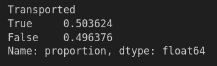
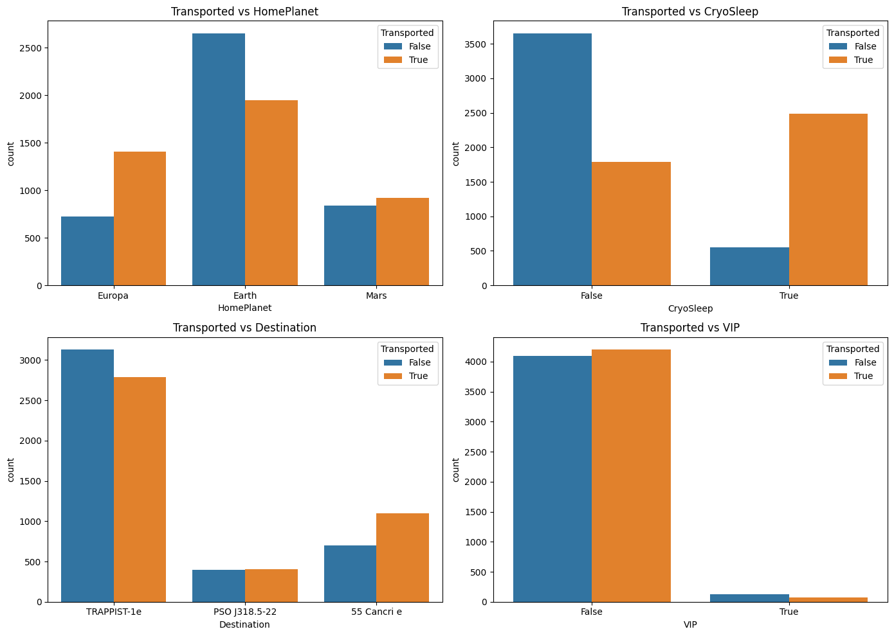
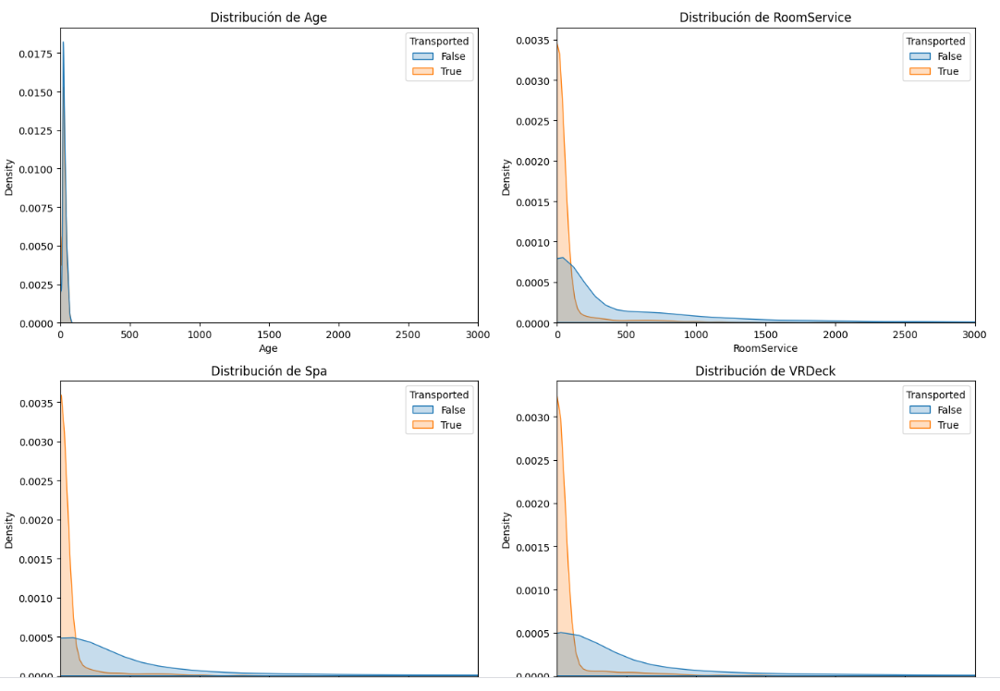
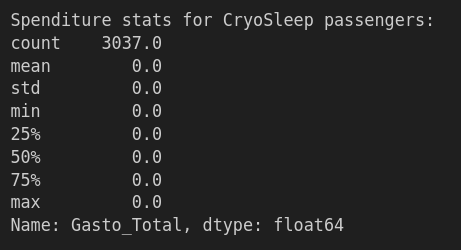

# Kaggle-Spaceship-Titanic

This repository contains my approach to the **Kaggle Space Titanic** competition. The goal is to predict which passengers were transported to an alternate dimension using data from the spaceship's manifest.

The first goal was to realize an EDA (Exploratory Data Analisys) to get some valuable information about the set in general but mainly about the numerical and cathegorical features (in order to make some feature engineering if possible).

My best insights were the following:
- The predicting variable was almost perfectly balanced, which is great because if not it would required some pre-processing techniques in order to solve that (a SMOTE for example), but this is not the case.

- The percentaje of Null variables is so low (<3% for all variables), which is good, and also easy to fill correctly (we will see that later).
- Analyzing cathegorical values, we can observe that the CryoSleep seems to be a really good predictor, since you can see a lot of change in Transported (those who were CryoSleeping have less probabilites to be transported).

- Analyzing numerical values, we can see that those who spent more money on ship commodities were the ones with less transported affected. 

It may seem that the spenditure on commodities has a lot of predicting power, but if we look closer, we would notice that those cryogenized cannot spend money! So we have a perfect correlation, those who were cryogenized spent 0 money (that explains the above plots)

